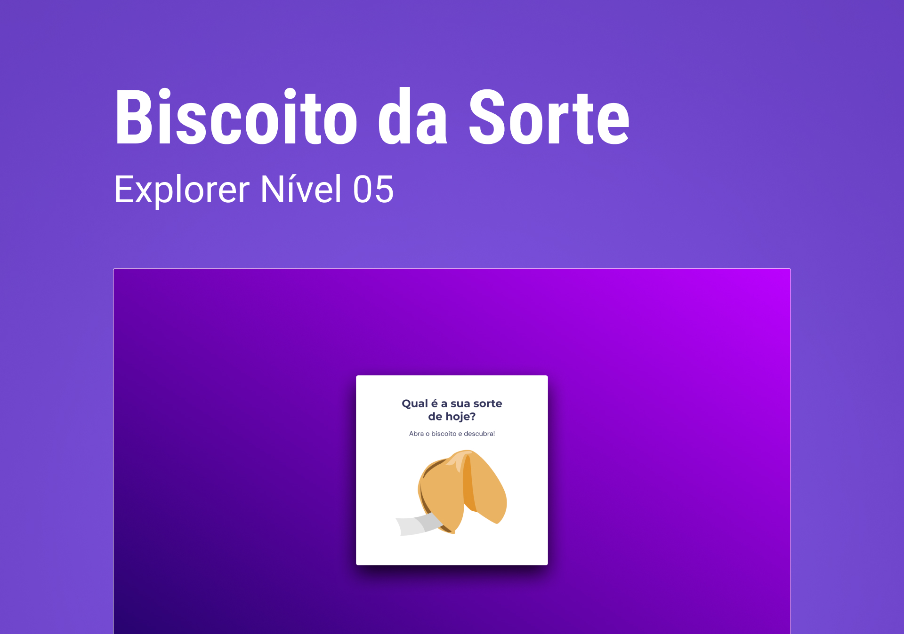

<h1 align="center">Curso Explorer Stage 05 - RocketSeat - Projeto Biscoito da Sorte / Fortune Cookie</h1>

Projeto desenvolvido no curso Explorer da Rocketseat, de uma aplicação simples com tecnologias HTML, CSS e JavaScript.

Veja o resultado <a href="https://rafaverde.github.io/fortune-cookie/" target="_blank">aqui.</a>

  <a href="#-tecnologias">Tecnologias</a>&nbsp;&nbsp;&nbsp;|&nbsp;&nbsp;&nbsp;
  <a href="#-projeto">Projeto</a>&nbsp;&nbsp;&nbsp;|&nbsp;&nbsp;&nbsp;
  <a href="#-layout">Layout</a>&nbsp;&nbsp;&nbsp;|&nbsp;&nbsp;&nbsp;
  <a href="#memo-licença">Licença</a>

  

 

  

## 🚀 Tecnologias

Esse projeto foi desenvolvido com as seguintes tecnologias:

- HTML e CSS
- JavaScript
- Git e Github
- Figma

## 💻 Projeto

Uma aplicaçõa em JavaScript e layout em HTML e CSS de um jogo simples para sortear frases de um biscoito da sorte, com efeitos de animação em CSS, funções e eventos em JS.

## 🔖 Layout

Você pode visualizar o layout do projeto através [DESSE LINK](https://www.figma.com/community/file/1182751789348533739). É necessário ter conta no [Figma](https://figma.com) para acessá-lo.

## :memo: Licença

Esse projeto está sob a licença MIT.

---

Feito com ♥ by Rocketseat/[rafaverde](https://github.com/rafaverde) :wave: [Participe da nossa comunidade!](https://discord.gg/rocketseat)

# fortune-cookie
